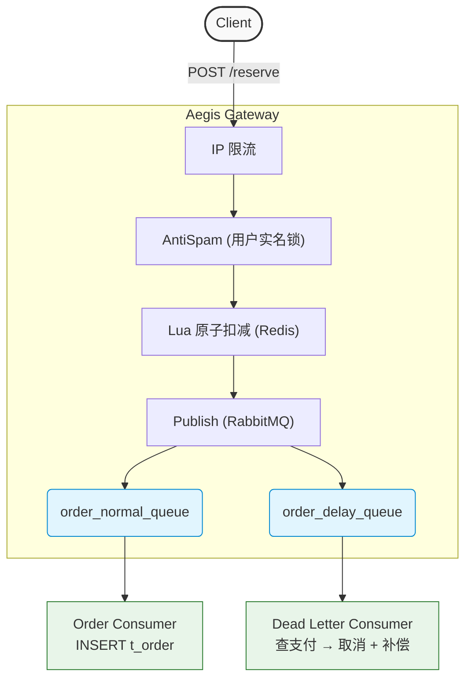
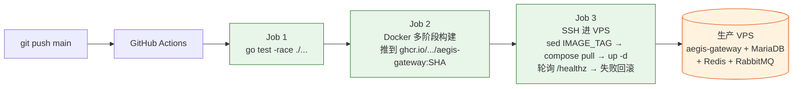

# Aegis Gateway (磐石网关)

[English](README.md) | [简体中文](README.zh.md)

> 高并发稀缺资源预约系统: Redis Lua + RabbitMQ 死信队列 + **可靠消息最终一致性**，单机 50K QPS

[]() 
[]()
[]()

---

## 项目背景

解决稀缺资源抢购预约，比如九价疫苗，稀缺矿物等的稀缺资源抢购场景下的超卖防护、用户重复提交防御、未支付订单的自动取消。

---

## 系统架构



---

## 核心技术

### 1. 防超卖：Redis Lua原子扣减
- 单条lua在 Redis 单线程中原子执行 GET / SISMEMBER / DECR / SADD
- 200并发压测中，1 库存 200 请求，恰好 1 成功
- 启动时用 ScriptLoad 缓存 SHA 1，请求复用 EvalSha 减少网络传输

### 2. 防重复：分布式实名锁 (2s TTL + 看门狗续期)
- uuid + SETNX 加锁
- Watchdog goroutine 每 TTL/3 用 Lua check-and-PEXPIRE续期
- Unlock 用 Lua check-and-DEL 防止误删其他用户的锁

### 3. 可靠消息最终一致性：RabbitMQ 双队列 + 死信补偿

> 区别于 TCC / Saga：本方案属于经典的"可靠消息最终一致性"——消息在 RabbitMQ 持久化，死信消费者保证即使单步失败或重启，DB 和 Redis 状态最终都会被对齐。

- 抢购成功的信息同时进 normal queue (立即下单) 和 delay queue (15分钟 TTL)
- delay queue 到期 ——> 死信至 dead queue ——> 检查支付状态 ——> 未付则 UPDATE t_order + 补偿Redis库存
- compensate.lua 抗重复执行 (内置幂等门 SISMEMBER)

### 4. 重试机制：独立双延迟队列 + Header 计数器重试
- DB抖动时信息进入 retry queue, normal queue的信息进入 normal retry queue, dead queue的信息进入 dead retry queue。 (1分钟 TTL)回流原队列
- Headers["x-retry-count"] 累加，超 3 次进入人工干预日志

---

## 性能数据

### 测试环境

WSL2 (Ubuntu) + Redis/MySQL/RabbitMQ Docker 单机部署。
`ulimit -n 65535`，Redis 开启 AOF 持久化（`appendonly yes`），RabbitMQ delivery_mode=2（持久化消息）。
8 线程 / 200 并发 / 30 秒压测

### A 组：HTTP 层吞吐极限（不触发 Lua / Redis）

| 阶段 | 优化点 | QPS | 平均延迟 |
|------|--------|-----|---------|
| 基线 | `gin.Default()` debug 模式 | 25,130 | 75ms |
| 释放日志开销 | `gin.SetMode(Release)` + `gin.New()` + Recovery | **429,586** | **844µs** |

> 此组测试中请求被前置中间件快速 reject，反映纯 HTTP 框架性能上限。

### B 组：端到端业务吞吐（完整调用 Redis Lua）

| 指标 | 数值 |
|------|------|
| QPS | **50,365** |
| 平均延迟 | 4.23ms |
| 延迟 stddev | 5.45ms |
| 瓶颈定位 | go-redis EvalSha 网络 RTT（火焰图证据） |

> 此组测试调用完整的 Reserve → EvalSha → Lua 链路，4.23ms 中约 4ms 为 Redis 网络往返。

---

## 火焰图分析

### 图 1：基线


---


优化前火焰图：gin.LoggerWithConfig → fmt.Fprint → syscall.Write 占用大量 CPU，每条请求一次 stderr 写入是隐藏瓶颈。

---
### 图 2：最终


---


优化后火焰图：业务主链清晰可见 service.Reserve → go-redis.EvalSha → runtime.netpoll，瓶颈完全转移到 Redis 网络 I/O，业务代码零冗余热点。

---
### 图 3：系统健康度


---


Goroutine profile 显示 200 并发下 390 个 goroutine 全部健康——仅在 HTTP 接收和 Redis 读取处阻塞，无 Mutex 竞争、无 GC 卡顿、无 I/O 堆积。

---

## 部署架构

GitHub Actions 上跑端到端 CI/CD。每次 push 到 `main` 触发三个串行 job：



**关键设计：**

- **镜像 tag = commit SHA**：每次部署唯一可定位；回滚只需把 `IMAGE_TAG=<旧 SHA>` 就行，无需重新构建。
- **两份 compose 文件**：`docker-compose.yml` 本地用（`build: .`），`docker-compose.prod.yml` VPS 用（`image: ghcr.io/...`），避免开发/生产配置互相污染。
- **CI 专用 SSH key**：单独的 ed25519 keypair 只授权部署；个人 SSH key 不进 GitHub Secrets。
- **PAT 代替 GITHUB_TOKEN 拉镜像**：VPS 用只有 `read:packages` 权限的 token，即使泄漏影响面也只读。
- **`sed -i` 而不是 `>` 覆盖 `.env.prod`**：部署时只改 `IMAGE_TAG`，保留生产凭据，避免清空所有配置。
- **`/healthz` 深度健康检查 + 自动回滚**：根级 `GET /healthz`（挂在 `/api/v1` 之外、不过 AntiSpam）主动 ping Redis、MySQL 和 RabbitMQ channel——任一依赖挂掉返回 `503`，全部正常返回 `200 {"status":"healthy"}`。用在两处：
  - **Compose 健康检查**：`aegis-gateway` 服务每 10s 用 `wget` 探活 `/healthz`（Alpine 基础镜像没 `curl`），让 Docker 准确上报容器健康状态。
  - **部署后探活闸门**：`up -d` 后，deploy job 先备份上一个 `IMAGE_TAG`（`.env.prod.bak`），再轮询 `/healthz` 最多 20 次（每次间隔 3s，约 60s 上限）。成功则清理悬空镜像并 exit 0；若 20 次全挂，则用 `sed` 把 `IMAGE_TAG` 改回上一个 SHA、重新部署并 exit 1，让 CI 标红、坏镜像绝不留在线上。

---

## 数据表结构

MySQL 侧只存订单记录，热点路径（库存计数 + 买家集合）全部在 Redis 上。

```sql
CREATE TABLE t_order (
    order_no    VARCHAR(64)  PRIMARY KEY COMMENT 'UUID v4，带 ORD- 前缀',
    user_id     VARCHAR(32)  NOT NULL,
    resource_id BIGINT       NOT NULL,
    status      TINYINT      NOT NULL DEFAULT 0
                COMMENT '0=待支付  1=已支付  2=已取消',
    created_at  DATETIME     DEFAULT CURRENT_TIMESTAMP,
    updated_at  DATETIME     DEFAULT CURRENT_TIMESTAMP
                                       ON UPDATE CURRENT_TIMESTAMP,
    UNIQUE KEY  uk_user_resource (user_id, resource_id)
) ENGINE = InnoDB DEFAULT CHARSET = utf8mb4 COLLATE = utf8mb4_unicode_ci;
```

**设计取舍：**

- **主键用 VARCHAR(order_no)**：UUID 分布式生成无需协调，但随机插入会让 InnoDB B+Tree 频繁页分裂。当前可接受；若写吞吐成瓶颈再换 Snowflake。
- **`(user_id, resource_id)` 用 UNIQUE KEY** — *纵深防御*：Redis `SISMEMBER` 是第一道防线（O(1)，性能优先）。但 Redis 重启 / 主从切换可能丢失内存数据，MySQL 的 UNIQUE 约束作为**兜底防线**——即使 Redis 失守，DB 层也能拒绝重复订单插入。
- **时间字段用 DATETIME**：TIMESTAMP 2038 年溢出（32 位整数）。DATETIME 范围到 9999 年，多占 3 字节相对数据和索引可忽略。

完整 schema 见 [`scripts/init.sql`](scripts/init.sql)。

---

## 项目结构

```text
aegis-gateway/
├── .github/
│   └── workflows/
│       └── cicd.yml                     # CI/CD 流水线：测试 → 构建镜像 → 推 ghcr.io → SSH 部署
├── cmd/
│   └── api/
│       └── main.go                      # 程序入口，初始化各组件并启动 HTTP 服务
├── internal/
│   ├── api/
│   │   ├── handler/
│   │   │   └── reserve.go               # 解析请求、参数校验、调 service
│   │   └── middleware/
│   │       ├── ratelimit.go             # IP 令牌桶限流（golang.org/x/time/rate）
│   │       └── anti_spam.go             # 用户实名分布式锁防重
│   ├── bootstrap/
│   │   ├── db.go                        # 初始化 MySQL 连接池
│   │   ├── redis.go                     # 初始化 Redis + 预加载 Lua 脚本（ScriptLoad）
│   │   ├── rabbitmq.go                  # 声明交换机、队列、绑定规则
│   │   └── router.go                    # 注册 Gin 路由和中间件，读 APP_MODE 切换限流强度
│   ├── consumer/
│   │   ├── order_consumer.go            # 正常订单消费者：监听 order_normal_queue，InsertOrder
│   │   ├── dead_letter_consumer.go      # 死信消费者：超时未支付 → 取消订单 + 补偿 Redis
│   │   └── helper.go                    # 公共辅助：getRetryCount（AMQP Header 类型断言）
│   ├── global/
│   │   └── global.go                    # 全局单例（DB、Redis、ReserveSHA、CompensateSHA、MQChannel）
│   ├── repository/
│   │   ├── mysql_repo.go                # InsertOrder / GetOrderByUserAndResource / UpdateOrderStatus
│   │   └── redis_repo.go                # Redis 操作封装
│   └── service/
│       ├── reserve_service.go           # 核心业务：EvalSha Lua + 投递 MQ 双消息
│       └── reserve_service_test.go      # 并发压测单测：200 goroutine 争 1 库存
├── pkg/
│   └── distributed_lock/
│       ├── lock.go                      # 分布式锁：SETNX+TTL 加锁、Lua 原子解锁、看门狗续期
│       └── lock_test.go                 # 锁的单元测试
├── scripts/
│   ├── lua/
│   │   ├── reserve.lua                  # 原子库存扣减：库存检查 → SISMEMBER → DECR + SADD
│   │   └── compensate.lua               # 幂等补偿：SISMEMBER 守门 → INCR + SREM
│   ├── wrk.sh                           # 生成 wrk 压测 Lua 脚本到 /tmp/reserve.lua
│   └── test_day3.sh                     # Day 3 接口冒烟测试脚本
├── go.mod
├── go.sum
├── docker-compose.yml                   # 本地开发栈：从源码构建 aegis-gateway + MySQL + Redis + RabbitMQ
├── docker-compose.prod.yml              # 生产部署栈：从 ghcr.io 拉 aegis-gateway 镜像
├── Dockerfile                           # 多阶段构建：golang:1.26-alpine → alpine:3.19
├── .env.example                         # 凭据模板（复制为 .env 后填入密码）
└── LICENSE
```

---

## 快速开始

### 方式 A — Docker（推荐）

```bash
# 1. 配置凭据
cp .env.example .env        # 填入密码

# 2. 一键启动所有服务
docker compose up --build -d

# 3. 建表
docker exec -it appoint_mysql mysql -uroot -p"${MYSQL_ROOT_PASSWORD}" appoint_db < scripts/init.sql
```

### 方式 B — 本地运行（开发调试）

```bash
# 1. 配置凭据
cp .env.example .env        # REDIS_ADDR=127.0.0.1:6379, MYSQL_ADDR=127.0.0.1:3309 等

# 2. 只启动依赖
docker compose up -d mysql redis rabbitmq

# 3. 建表
docker exec -it appoint_mysql mysql -uroot -p"${MYSQL_ROOT_PASSWORD}" appoint_db < scripts/init.sql

# 4. 启动服务
go run cmd/api/main.go
```

### 压测

```bash
APP_MODE=loadtest go run cmd/api/main.go    # 摘掉限流
bash scripts/wrk.sh
wrk -t8 -c200 -d30s -s /tmp/reserve.lua http://localhost:8080/api/v1/reserve
```

## 进一步优化方向

- [x] Graceful shutdown（SIGTERM 等消费者处理完手头消息）
- [x] GitHub Actions 端到端 CI/CD：测试 → 构建镜像 → 推 ghcr.io → SSH 部署 VPS
- [x] 部署后健康检查 + 失败自动回滚（`/healthz` 深度探活 + 20 次轮询 → 回滚）
- [ ] Redis pipeline 批处理（预期 QPS +50%）
- [ ] 本地内存预扣减 + Redis 异步同步（预期 5-10x）
- [ ] 死信表持久化（运维可追溯）

---

## 技术栈

Go 1.26 / Gin / go-redis v9 / amqp091-go / Lua / Docker Compose
